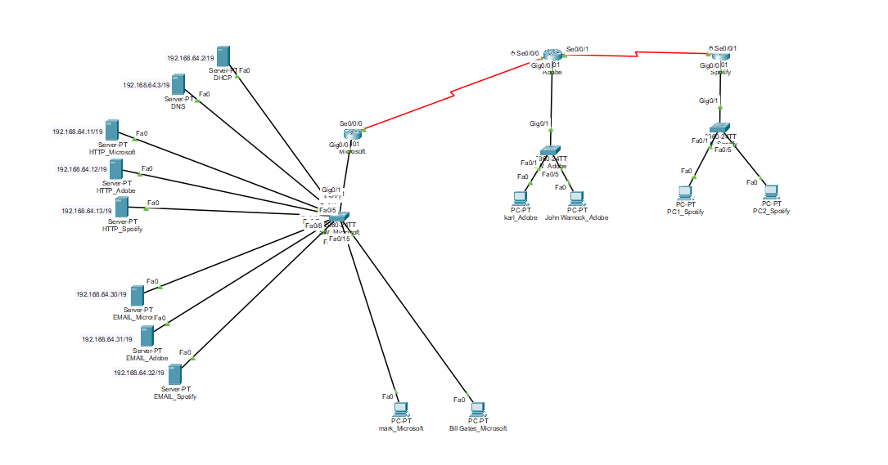

# Cisco Packet Tracer – The Three Companies Network Project

## Project Overview
This Cisco Packet Tracer project simulates three companies: **Microsoft**, **Adobe**, and **Spotify**. Each company has separate VLANs for **Employees**, **Management**, and **Servers**, demonstrating network segmentation, IP addressing, VLANs, and inter-VLAN routing. The project also includes inter-company connectivity through point-to-point links.

**Date Completed:** Febuary 2025  
**Tools Used:** Cisco Packet Tracer  

---

## Network Topology
  

The topology shows the network layout for all three companies, including switches, routers, and end devices.

---

## VLANs and IP Addressing

| Company   | VLAN       | IP Address (Subnet) | Start IP      | End IP        | Subnet Mask     | Gateway       |
|-----------|------------|------------------|---------------|---------------|----------------|---------------|
| Microsoft | Employees  | 192.168.0.0/19    | 192.168.0.1   | 192.168.31.254 | 255.255.224.0  | 192.168.0.1   |
| Microsoft | Management | 192.168.32.0/19   | 192.168.32.1  | 192.168.63.254 | 255.255.224.0  | 192.168.32.1  |
| Microsoft | Servers    | 192.168.64.0/19   | 192.168.64.1  | 192.168.95.254 | 255.255.224.0  | 192.168.64.1  |
| Adobe     | Employees  | 192.168.128.0/19  | 192.168.128.1 | 192.168.159.254| 255.255.224.0  | 192.168.128.1 |
| Adobe     | Management | 192.168.160.0/19  | 192.168.160.1 | 192.168.191.254| 255.255.224.0  | 192.168.160.1 |
| Spotify   | Employees  | 192.168.192.0/19  | 192.168.192.1 | 192.168.223.254| 255.255.224.0  | 192.168.192.1 |
| Spotify   | Management | 192.168.224.0/19  | 192.168.224.1 | 192.168.255.254| 255.255.224.0  | 192.168.224.1 |

---

## Inter-Company Links

| Link Network          | Subnet        | Start IP   | End IP     | Subnet Mask      | Notes            |
|----------------------|---------------|------------|------------|-----------------|-----------------|
| Microsoft–Adobe      | 10.0.0.0/30   | 10.0.0.1   | 10.0.0.2   | 255.255.255.252 | Point-to-point   |
| Adobe–Spotify        | 10.0.0.4/30   | 10.0.0.5   | 10.0.0.6   | 255.255.255.252 | Point-to-point   |
| Spotify–Microsoft    | 10.0.0.8/30   | 10.0.0.9   | 10.0.0.10  | 255.255.255.252 | Point-to-point   |

---

## Project Features
- VLAN segmentation for **Employees**, **Management**, and **Servers**
- Proper **IP addressing** with subnetting
- Inter-company **connectivity** using point-to-point links
- Simulation of **HTTP, DNS, DHCP, and email servers**
- Demonstrates **routing between VLANs** and inter-company routing

---

## Skills Demonstrated
- Cisco Packet Tracer network simulation
- VLAN creation and management
- IP subnetting and addressing
- Router configuration and inter-VLAN routing
- Troubleshooting and testing network connectivity

---

## Files Included
- `Three_Companies_Project.pkt` – Cisco Packet Tracer file  
- `README.md` – Project documentation  

---

## How to Use
1. Open `Three_Companies_Project.pkt` in Cisco Packet Tracer.  
2. Review the VLAN and IP configurations on each switch and router.  
3. Test network connectivity between PCs and servers across VLANs and companies.  

---

**Note:** This project was created by Leo Nilsson.  

